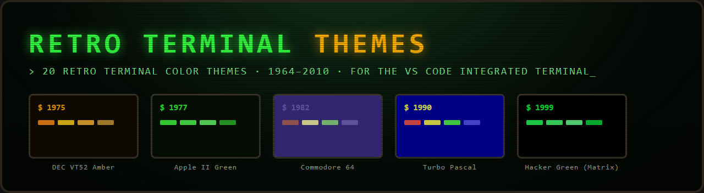
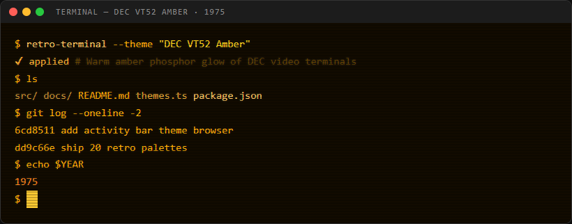
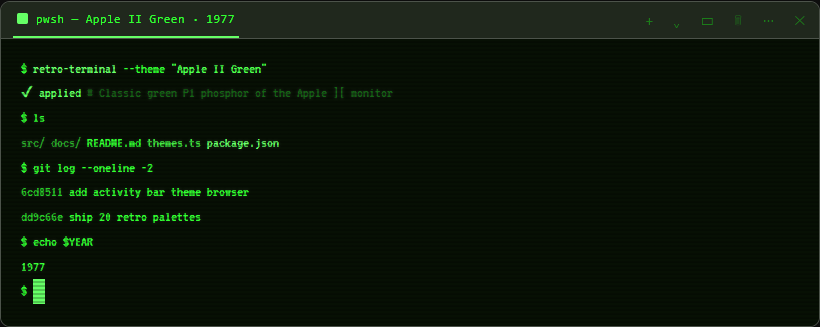
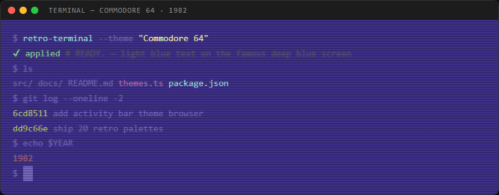
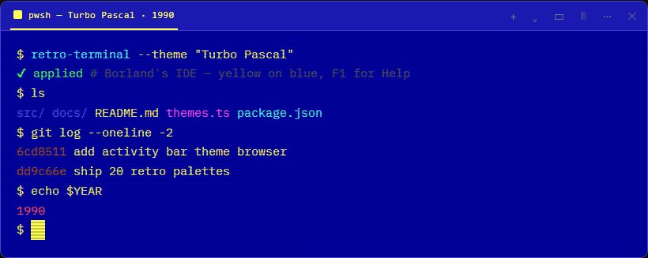
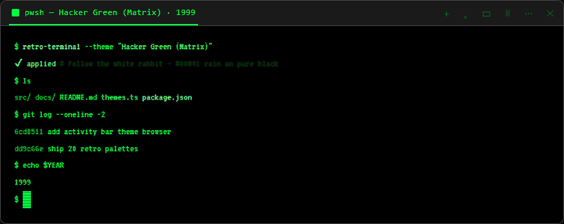
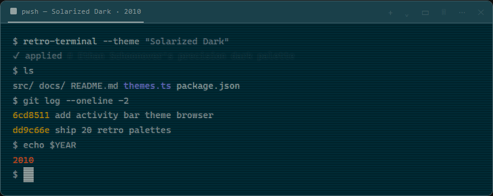

  

<h1 align="center">Retro Terminal Themes</h1>

<b>20 retro terminal color themes spanning 1964–2010 — with a CRT-styled one-click picker right in your sidebar.</b>

  
  
  
  
  

  <b>Your editor theme stays. Only the terminal time-travels.</b> 
  IBM Mainframe · Punch Card · VT52 Amber · Apple II · DOS · Commodore 64 · ZX Spectrum · Macintosh · CGA · Amiga · Turbo Pascal · Windows 3.1 · Norton Commander · Windows 95 · Matrix · XP Luna · OS X Aqua · Ubuntu · Solarized

---

## Screenshots

> Every mockup below is rendered from the theme's actual palette.

### 🟠 DEC VT52 Amber · 1975
Warm amber phosphor glow of DEC video terminals.

### 🟢 Apple II Green · 1977
The classic green P1 phosphor of the Apple ][ monitor.

### 🔵 Commodore 64 · 1982
`READY.` — light blue text on the famous deep blue screen.

### 🟡 Turbo Pascal · 1990
Borland's IDE — yellow on blue, F1 for Help.

### 🟩 Hacker Green (Matrix) · 1999
Follow the white rabbit — `#00ff41` rain on pure black.

### 🌒 Solarized Dark · 2010
Ethan Schoonover's precision palette, faithfully reproduced.

---

## Installation

### Easy Installation

Get started in under a minute:

1. Open the **Extensions** sidebar in Visual Studio Code (`Ctrl+Shift+X` / `Cmd+Shift+X`).
2. Search for **Retro Terminal Themes**.
3. Click **Install**.
4. Click the **terminal icon** in the Activity Bar (left edge) to open the theme browser.
5. Pick any theme — the terminal restyles instantly.
6. Enjoy! And consider leaving a ⭐⭐⭐⭐⭐ review.

### Alternate Installation

Prefer the command palette?

1. Launch **Quick Open** — `Ctrl+P` (Windows/Linux) or `Cmd+P` (macOS).
2. Paste: `ext install ToqirAhmad.retro-terminal-themes`
3. Hit **Enter**, then **Install**.

---

## All 20 Themes

Four eras, five decades, 20 machines worth of nostalgia.

| Era | Themes |
| --- | --- |
| 🧮 **1960s–70s** | IBM Mainframe (1964) · Punch Card Beige (1965) · DEC VT52 Amber (1975) · Apple II Green (1977) |
| 🕹️ **1980s** | IBM PC DOS (1981) · Commodore 64 (1982) · ZX Spectrum (1982) · Apple Macintosh (1984) · CGA Magenta (1984) · Amiga Workbench (1985) |
| 💾 **1990s** | Turbo Pascal (1990) · Windows 3.1 (1992) · Norton Commander (1993) · Windows 95 Console (1995) · Hacker Green / Matrix (1999) |
| 💿 **2000s** | Windows XP Luna (2001) · OS X Aqua Terminal (2001) · Ubuntu Human (2004) · Solarized Dark (2010) · Solarized Light (2010) |

---

## Color Palette Reference

Every theme is a complete terminal palette — background, foreground, cursor, selection, and all 16 ANSI colors. A few of the highlights:

<table>
<tr>
<td valign="top">

<b>🟠 DEC VT52 Amber</b>
<table>
<tr><th>Role</th><th>Color</th><th>Hex</th></tr>
<tr><td>Background</td><td></td><td><code>#120B00</code></td></tr>
<tr><td>Foreground</td><td></td><td><code>#FFB000</code></td></tr>
<tr><td>Cursor</td><td></td><td><code>#FFCC33</code></td></tr>
<tr><td>Bright Red</td><td></td><td><code>#FF8C1A</code></td></tr>
<tr><td>Bright Green</td><td></td><td><code>#FFB733</code></td></tr>
<tr><td>Bright Yellow</td><td></td><td><code>#FFD11A</code></td></tr>
<tr><td>Bright Blue</td><td></td><td><code>#CC9933</code></td></tr>
</table>

</td>
<td valign="top">

<b>🔵 Commodore 64</b>
<table>
<tr><th>Role</th><th>Color</th><th>Hex</th></tr>
<tr><td>Background</td><td></td><td><code>#40318D</code></td></tr>
<tr><td>Foreground</td><td></td><td><code>#7869C4</code></td></tr>
<tr><td>Cursor</td><td></td><td><code>#7869C4</code></td></tr>
<tr><td>Red</td><td></td><td><code>#883932</code></td></tr>
<tr><td>Green</td><td></td><td><code>#55A049</code></td></tr>
<tr><td>Yellow</td><td></td><td><code>#BFCE72</code></td></tr>
<tr><td>Cyan</td><td></td><td><code>#67B6BD</code></td></tr>
</table>

</td>
<td valign="top">

<b>🌒 Solarized Dark</b>
<table>
<tr><th>Role</th><th>Color</th><th>Hex</th></tr>
<tr><td>Background</td><td></td><td><code>#002B36</code></td></tr>
<tr><td>Foreground</td><td></td><td><code>#839496</code></td></tr>
<tr><td>Cursor</td><td></td><td><code>#93A1A1</code></td></tr>
<tr><td>Red</td><td></td><td><code>#DC322F</code></td></tr>
<tr><td>Green</td><td></td><td><code>#859900</code></td></tr>
<tr><td>Yellow</td><td></td><td><code>#B58900</code></td></tr>
<tr><td>Blue</td><td></td><td><code>#268BD2</code></td></tr>
</table>

</td>
</tr>
</table>

---

## FAQ

**Does this change my editor theme?**
No — that's the whole point. It only writes terminal color keys into `workbench.colorCustomizations`, so your editor theme, UI colors, and syntax highlighting are untouched.

**Will it overwrite my existing color customizations?**
Never. Themes are *merged* into your settings, and the extension remembers exactly which keys it wrote — **Reset** strips only those and leaves everything else alone.

**Do the colors stay if I uninstall?**
Yes, because they live in your user settings. Run **Retro Terminal: Reset Terminal Colors** before uninstalling if you want the defaults back.

**Which theme is best for presentations or screencasts?**
High-contrast picks like **Hacker Green (Matrix)**, **DEC VT52 Amber**, **Apple II Green**, or **IBM PC DOS** read beautifully on a projector.

**Can I request a theme?**
Absolutely — open an issue on the [repository](https://github.com/TOQIR-AHMAD/Unix-Epoch).

---

## License

[MIT](LICENSE) © Toqir Ahmad

Made with 🖥️ and phosphor glow — if your terminal feels 40 years younger, consider leaving a ⭐ review on the <a href="https://marketplace.visualstudio.com/items?itemName=ToqirAhmad.retro-terminal-themes">Marketplace</a>.

